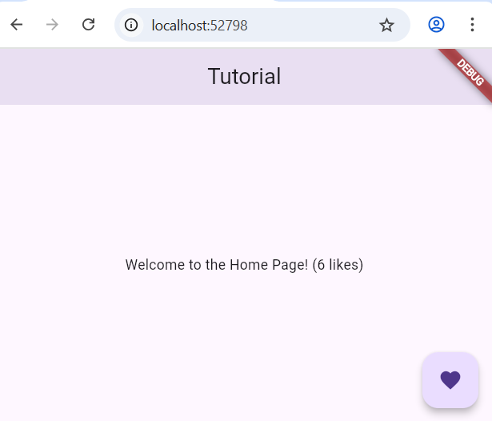
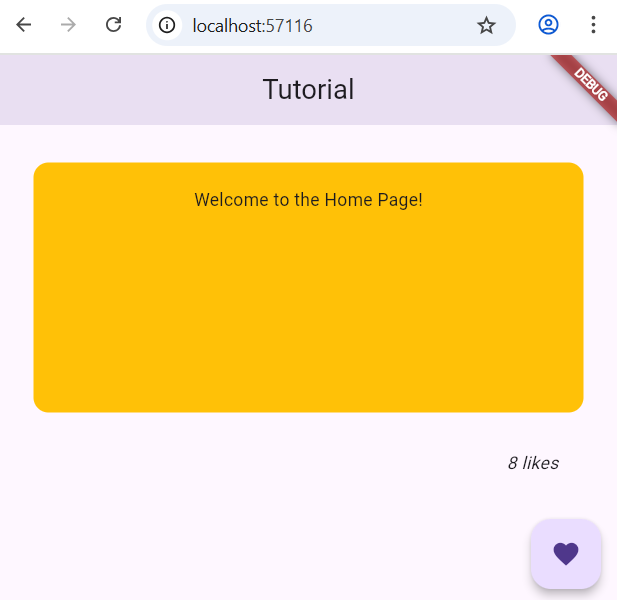

# Flutter tutorial 2

## Getting Started

This project is a starting point for a Flutter application.

A few resources to get you started if this is your first Flutter project:

- [Lab: Write your first Flutter app](https://docs.flutter.dev/get-started/codelab)
- [Cookbook: Useful Flutter samples](https://docs.flutter.dev/cookbook)

For help getting started with Flutter development, view the
[online documentation](https://docs.flutter.dev/), which offers tutorials,
samples, guidance on mobile development, and a full API reference.

## Step 1

In this new flutter tutorial, I have:

- Initialized a new project  
- Used Material Design  
- Integrated a `StatefulWidget` on the home page to count the number of likes.

## Step 2

Create a `Container()` Widget
